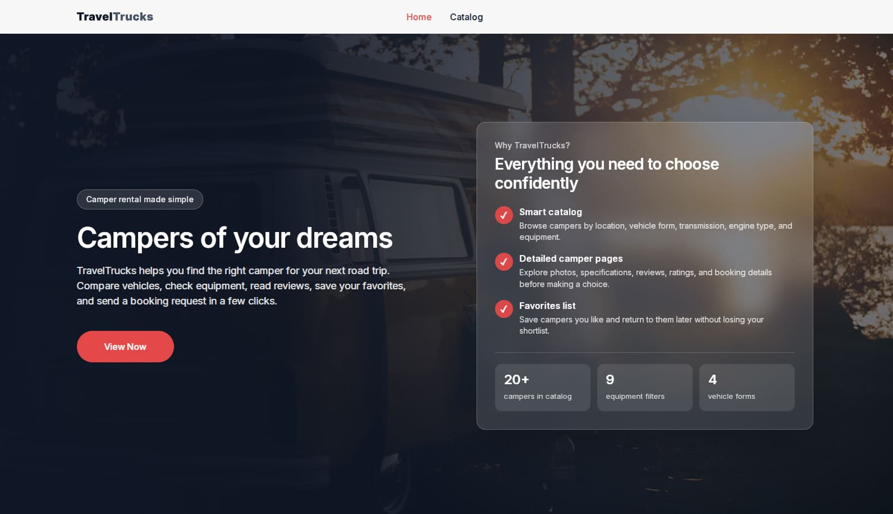
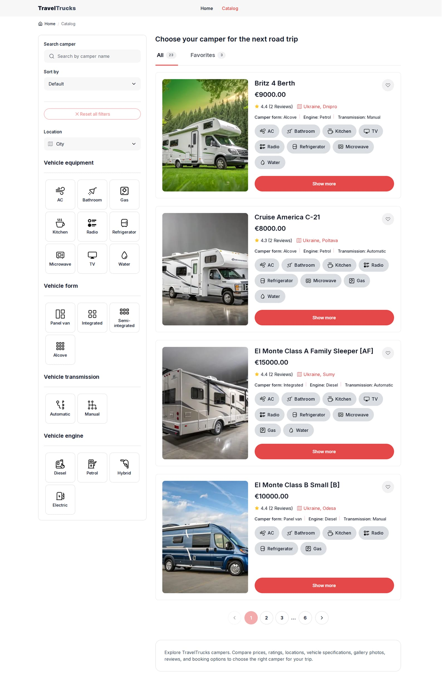
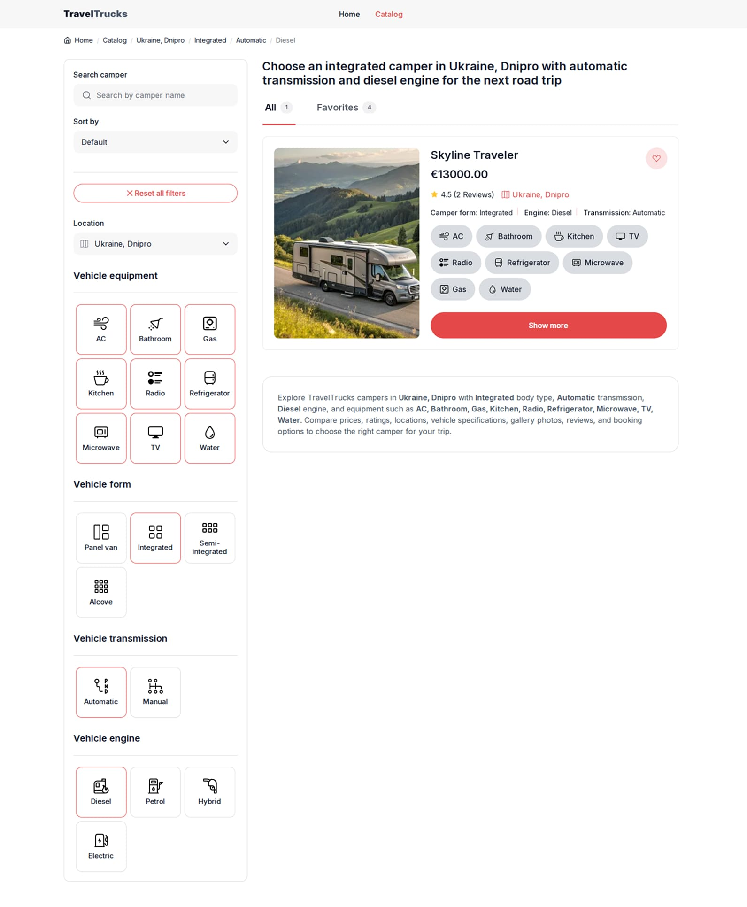
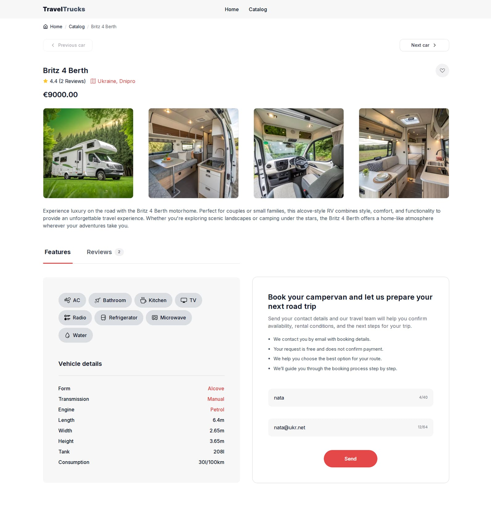
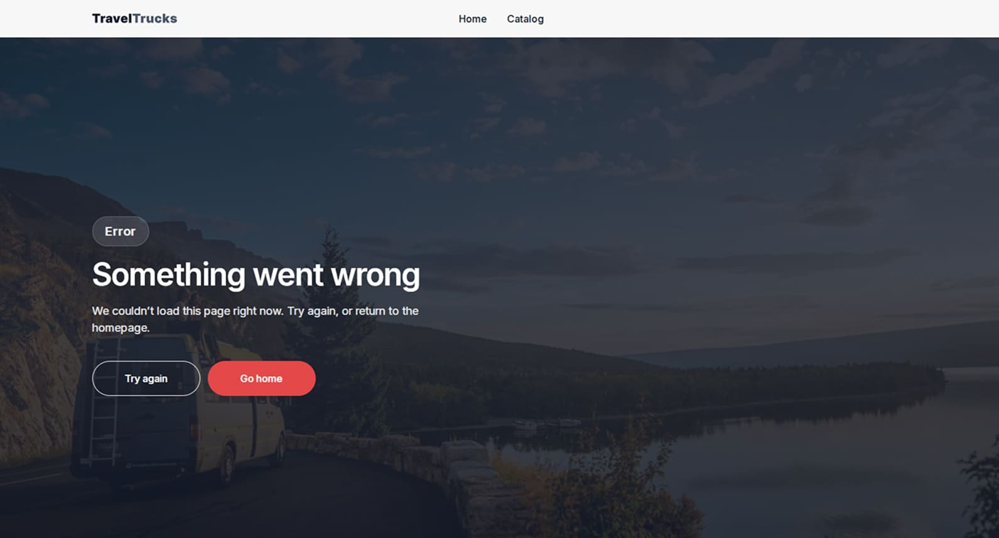
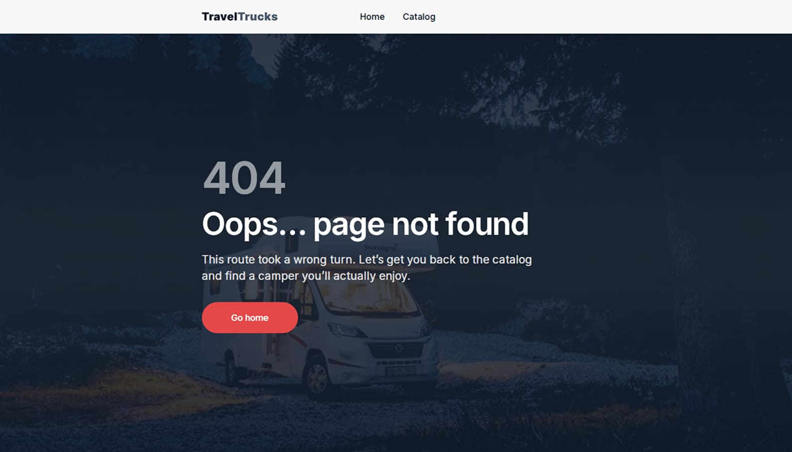

# TravelTrucks

> A modern camper rental catalog built with **Next.js**, **TypeScript**, **TanStack Query**, and **Zustand**.



## Overview

**TravelTrucks** is a responsive camper rental web application for browsing motorhomes, filtering catalog results, viewing detailed camper information, saving favorites, reading reviews, and sending booking requests.

The project focuses on clean UI, semantic routing, SEO-friendly pages, and a practical real-world catalog experience.

Users can explore campers by location, vehicle form, transmission, engine type, and equipment, compare key specifications, open detailed camper pages, view galleries and reviews, and submit a booking request through a validated form.

---

## Live Demo

```txt
https://travel-trucks-five-liart.vercel.app
```

---

## Screenshots

### Home page


### Catalog page



### Catalog with applied filters



### Camper details page



### Error page



### 404 page



---

## Features

### Core functionality

- browse a catalog of campers
- search campers by name
- filter campers by location
- filter by vehicle equipment
- filter by vehicle form
- filter by transmission type
- filter by engine type
- sort campers by price and rating
- view paginated catalog results
- save and remove campers from favorites
- open a dedicated favorites tab
- view detailed camper pages
- browse camper image galleries
- open images in a gallery modal
- view camper specifications
- read camper reviews and ratings
- submit a booking request
- navigate between previous and next camper pages
- view custom loading, error, and not-found states

### Catalog experience

- semantic URL-based catalog filters
- route-driven search and sorting state
- backend-supported filters for location, form, transmission, and engine
- BFF layer for search, sorting, equipment filtering, and pagination
- reset button that affects only real filters
- search and sort separated from filter reset logic
- breadcrumbs for structural catalog filters
- sticky desktop filters sidebar
- mobile and tablet filters drawer
- applied filters counter on mobile and tablet
- compact pagination with arrow controls and ellipsis

### Camper details

- dynamic camper detail pages
- canonical slug redirects for camper pages
- dynamic metadata for every camper
- gallery with optimized images
- camper rating and location information
- specifications section
- features section
- reviews section
- booking form with validation
- favorite button with toast feedback

### UX and UI

- responsive layout for mobile, tablet, and desktop
- reusable component architecture
- custom buttons and button links
- custom select controls
- reusable breadcrumbs
- reusable tabs
- reusable pagination
- reusable favorite button
- reusable toast notifications
- shimmer image loading states
- polished empty states
- custom 404 page
- custom error page
- accessible modal and drawer behavior
- body scroll lock for overlays
- Escape key and backdrop close behavior

### SEO and routing

- dynamic metadata for catalog pages
- dynamic metadata for camper detail pages
- Open Graph metadata
- Twitter card metadata
- canonical URLs
- robots.txt route
- dynamic sitemap.xml route
- camper detail pages included in sitemap
- noindex metadata for search, sorting, pagination, and error states
- SEO content block for catalog pages
- clean breadcrumbs without overloaded equipment filters

---

## Tech Stack

### Frontend

- **Next.js**
- **React**
- **TypeScript**
- **CSS Modules**

### State and data

- **TanStack Query**
- **Zustand**
- **Axios**

### Forms and validation

- **Formik**
- **Yup**

### UI utilities

- **Lucide React**
- **clsx**
- **react-hot-toast**

### API

- external campers API
- Next.js API routes as BFF layer
- REST endpoints for:
  - campers catalog
  - camper details
  - camper reviews
  - booking requests
  - available filters

---

## Project Structure

```txt
app/
  [slug]/
    CamperPageClient.tsx
    page.tsx
  api/
    campers/
      [id]/
        booking-requests/
        reviews/
      filters/
      route.ts
  catalog/
    [[...segments]]/
      CatalogPageClient.tsx
      page.tsx
  error.tsx
  globals.css
  layout.tsx
  loading.tsx
  not-found.tsx
  page.tsx
  robots.ts
  sitemap.ts

components/
  catalog/
    CamperCard/
    CampersList/
    CatalogFilters/
    CatalogOptionGrid/
    CatalogPageShell/
    CatalogSearch/
    CatalogSeoText/
    CatalogSort/
    FiltersDrawer/
    LocationFilter/
    VehicleEngineFilter/
    VehicleEquipmentFilter/
    VehicleFormFilter/
    VehicleTransmissionFilter/
  common/
    Breadcrumbs/
    Button/
    CloseButton/
    CustomSelect/
    FavoriteButton/
    FeatureBadges/
    InlineLoader/
    Pagination/
    RatingLocation/
    ShimmerImage/
    SvgIcon/
    Tabs/
    TanStackProvider/
    Toast/
  details/
    BookingForm/
    CamperDetailsBottom/
    CamperHero/
    CamperPrevNextNav/
    CamperSpecs/
    Gallery/
    ReviewsList/
  header/
    CompanyLogo/
    Header/
    MenuNav/
    MobileOffcanvas/

hooks/
  useBackdropClick.ts
  useBodyScrollLock.ts
  useCatalogCampers.ts
  useCatalogFilterOptions.ts
  useCatalogFilters.ts
  useDebouncedValue.ts
  useEscapeToClose.ts
  useFavoriteCampers.ts
  useFavorites.ts

lib/
  api/
  constants/
  queryKeys/
  seo/
  server/
  store/
  utils/

public/
  readme/
    car-information-page.jpg
    catalog-with-applied-filters.jpg
    catalog-without-applied-filters.jpg
    error-page.jpg
    home-page.jpg
    page-404.jpg
  404-page.jpg
  background-picture.jpg
  company-logo.svg
  error-page.jpg
  icons.svg

types/
```

---

## Routing Highlights

The application uses semantic and SEO-friendly URLs for catalog filtering and camper details.

### Catalog routes

```txt
/catalog
/catalog/location-ukraine-dnipro
/catalog/form-integrated
/catalog/transmission-automatic
/catalog/engine-diesel
/catalog/amenities-ac-bathroom-kitchen
/catalog/page-2
/catalog/search-bri
/catalog/sort-rating-desc
```

Search and sorting are reflected in the URL, but they are not treated as regular filters in the UI reset logic, breadcrumbs, or SEO metadata.

### Camper detail routes

Each camper has its own SEO-friendly page:

```txt
/britz-4-berth--cmniy1dvz000eyyoxgtlipyo4
/skyline-traveler--cmniydyf004ayyox1wfottx
/road-bear-c-23-25--cmniydwm0000yyoxsi4m4hns
```

If a camper is opened with an outdated or incorrect slug, the app redirects to the canonical URL.

---

## API and BFF Layer

The backend supports direct filtering by:

```txt
page
perPage
location
form
transmission
engine
```

The application adds a BFF layer through Next.js API routes to support additional catalog behavior:

```txt
search
sort
equipment filtering
client-facing pagination
response normalization
```

This keeps the UI flexible while still working with the backend contract.

---

## SEO

The project includes SEO support for both catalog and camper pages.

### Implemented SEO features

- dynamic page titles
- dynamic meta descriptions
- canonical URLs
- Open Graph metadata
- Twitter card metadata
- noindex logic for non-canonical catalog states
- dynamic sitemap generation
- valid robots.txt route
- camper detail pages included in sitemap
- SEO text block for catalog pages

### Sitemap includes

```txt
/
 /catalog
 /camper-detail-pages
```

### Excluded from indexing

```txt
/catalog/search-...
/catalog/sort-...
/catalog/page-...
error pages
404 pages
```

---

## Favorites

The project includes a local favorites feature powered by Zustand.

Users can:

- add campers to favorites
- remove campers from favorites
- view saved campers in the Favorites tab
- keep favorites after page reload
- see toast feedback after each action

Favorites are independent from currently applied catalog filters.

---

## Booking Form

The camper details page includes a booking request form.

### Form features

- name field
- email field
- validation with Yup
- Formik form state management
- disabled submit state while invalid or submitting
- draft syncing through Zustand
- success toast after request
- API request to create a booking request for a specific camper

---

## Environment Variables

Create a `.env` or `.env.local` file in the project root.

```env
NEXT_PUBLIC_SITE_URL=http://localhost:3000
NEXT_PUBLIC_API_BASE_URL=your_backend_api_url
```

For production, set:

```env
NEXT_PUBLIC_SITE_URL=https://travel-trucks-five-liart.vercel.app
```

> Do not commit `.env` or `.env.local` files.

---

## Getting Started

### 1. Clone the repository

```bash
git clone https://github.com/Natalia-Skoropad/travel-trucks
cd travel-trucks
```

### 2. Install dependencies

```bash
npm install
```

### 3. Add environment variables

Create `.env.local` and fill in the required values.

### 4. Run the development server

```bash
npm run dev
```

### 5. Open the app

```txt
http://localhost:3000
```

---

## Available Scripts

```bash
npm run dev
npm run build
npm run start
npm run lint
```

---

## Deployment

The project is deployed on **Vercel**.

Before deployment, check:

```bash
npm run lint
npm run build
```

Make sure production environment variables are configured in Vercel.

---

## Highlights

What makes this project especially interesting:

- dynamic camper detail pages with canonical slugs
- route-driven catalog filtering
- BFF layer for search, sorting, equipment filtering, and pagination
- dynamic sitemap with camper pages
- valid robots.txt generation
- sticky desktop filters sidebar
- mobile and tablet filters drawer
- applied filters counter
- favorites tab independent from active filters
- polished camper cards and details pages
- custom error and 404 pages
- reusable UI components
- centralized type guards and data normalization
- SEO-focused metadata architecture

---

## Author

**Nataliia Skoropad**  
Frontend Developer  
UX/UI redesign and user experience improvements

---

## License

This project is created for educational and portfolio purposes.
